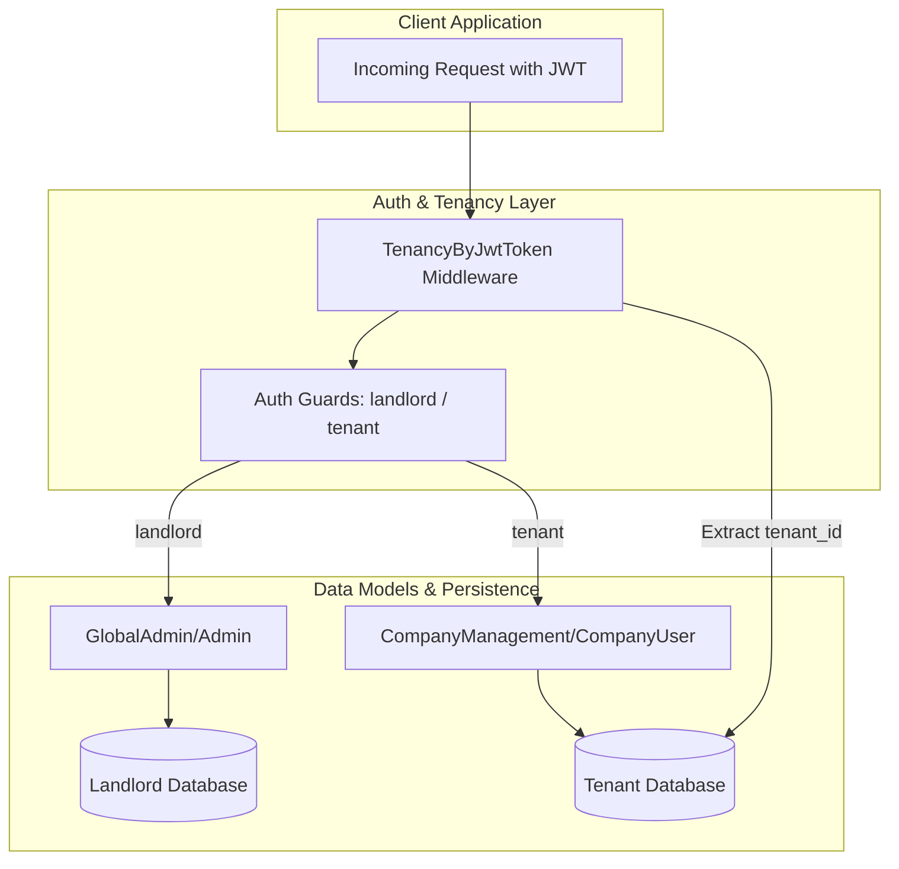

# Documentation: JWT Auth & Multi-Tenancy Configuration

## 1. Executive Summary

This document outlines the technical implementation of the dual JWT (JSON Web Token) authentication system and its integration with the multi-tenancy architecture. The implementation enables secure authentication for both global administrators and tenant-specific users, providing a robust foundation for the Sifet platform's security and data isolation.

---

## 2. Architecture Overview

The system utilizes a dual-guard approach to differentiate between the **Landlord** (Global Admin) and **Tenant** (Company Management) contexts.

---

## 3. Configuration Details

### 3.1 JWT Secret Generation
A unique `JWT_SECRET` was generated and stored in the environment configuration to sign and verify tokens.

> [!IMPORTANT]
> The `JWT_SECRET` is the primary security key for the application. Ensure it is never committed to version control in production environments.

### 3.2 Authentication Guards (`config/auth.php`)
The following guards and providers were added to the authentication system:

| Guard      | Driver | Provider        | Context                      |
| :--------- | :----- | :-------------- | :--------------------------- |
| `landlord` | `jwt`  | `admins`        | Global Administrative Access |
| `tenant`   | `jwt`  | `company_users` | Tenant-Specific Access       |

**Providers Mapping:**
- `admins` &rarr; `Modules\GlobalAdmin\Models\Admin`
- `company_users` &rarr; `Modules\CompanyManagement\Models\CompanyUser`

> [!WARNING]
> Both `Admin` and `CompanyUser` models utilize the `'password' => 'hashed'` cast (Laravel 10+). This automatically hashes the password when it is assigned to the model. **Do not use `Hash::make()` or `bcrypt()` in your controllers or services**, as this will result in double-hashing and break authentication.

---

## 4. Implementation Components

### 4.1 Stub Models
New models were created to implement the `Tymon\JWTAuth\Contracts\JWTSubject` interface, allowing them to be used with the JWT driver.

*   **`Admin` Model**: Configured to use the `UsesLandlordConnection` trait to ensure all administrative queries target the central database.
*   **`CompanyUser` Model**: Configured for standard tenant-based Eloquent operations.

### 4.2 Tenancy Resolution Middleware
The `TenancyByJwtToken` middleware was engineered to automatically resolve the tenant context based on a `tenant_id` claim embedded within the JWT.

> [!TIP]
> This approach allows for "zero-configuration" client requests. As long as the client provides a valid token, the backend automatically switches to the correct tenant database.

---

## 5. Verification & Testing

### 5.1 Automated Unit Tests
A comprehensive test suite (`AuthConfigTest.php`) was executed to ensure the integrity of the configuration.

| Test Case                            | Objective                                         | Status   |
| :----------------------------------- | :------------------------------------------------ | :------- |
| `test_auth_guards_are_configured`    | Verify landlord/tenant guard existence and driver | **PASS** |
| `test_auth_providers_are_configured` | Verify provider model mapping and drivers         | **PASS** |

### 5.2 System Stability
The `php artisan` command sequence was executed to verify that the configuration changes did not introduce any regressions or boot-time errors.

---

## 6. Next Steps

- [ ] Implementation of Login/Logout controllers for both guards.
- [ ] Integration of JWT Refresh logic.
- [ ] Role-based access control (RBAC) implementation for Admins.

---

## 7. Security Considerations & Tenant Validation

To prevent unauthorized cross-tenant access, the system implements a multi-layered security model centered on the JWT `tenant_id` claim.

### 7.1 Cryptographic Integrity
The `tenant_id` is a **trusted claim** embedded within the JWT payload. Since the JWT is digitally signed using the `JWT_SECRET`:
- Any modification to the `tenant_id` by a malicious actor will invalidate the signature.
- The server will reject the token before the `TenancyByJwtToken` middleware can even attempt to switch the database context.

### 7.2 Authorization via Isolation
The system follows an "Isolation by Design" principle:
1. **Resolution**: The `TenancyByJwtToken` middleware switches the database connection to the specific tenant DB identified in the token.
2. **Authentication**: The subsequent Auth Guard (`tenant`) attempts to find the user **only within that specific tenant database**.
3. **Prevention**: Even if a user obtains a valid token for *Tenant A*, they cannot access *Tenant B* because their user record simply does not exist in *Tenant B*'s database.

### 7.3 Error Handling
- **Missing/Invalid Token**: Handled via `PHPOpenSourceSaver\JWTAuth\Exceptions\JWTException`. The middleware silently continues, allowing the authentication guard or `NeedsTenant` middleware to handle the failure as appropriate for the specific route.
- **Unexpected Errors**: General exceptions (e.g., database failures) are caught and logged as warnings (`Log::warning`) to prevent silent masking of critical system issues.
- **Invalid Tenant ID**: If the `tenant_id` in the token does not exist in the landlord database, no tenant is made current. The request will then be blocked by the `NeedsTenant` middleware (returning a 400/404 error).
- **Graceful Fallback**: The middleware is designed to allow other resolution methods (like domain detection) if a JWT is not present, ensuring flexibility for public or hybrid routes.

---

## 8. Token Lifecycle & Security Best Practices

The system adheres to industry-standard JWT lifecycle management to balance user experience with high security.

### 8.1 Token Expiration (TTL)
The default token lifetime is configured to **60 minutes**. 
- **Short-lived Access Tokens**: Minimizes the window of opportunity if a token is intercepted.
- **Refresh Window**: A refresh TTL of **2 weeks** (20,160 minutes) is set, allowing users to stay logged in without re-entering credentials, provided they remain active.

### 8.2 Token Revocation & Blacklisting
To ensure immediate lockout upon logout or security breach:
- **Blacklist Enabled**: The system uses the `blacklist_enabled` setting. When a user logs out, the specific `jti` (JWT ID) is added to the application's cache/storage.
- **Grace Period**: A 0-second grace period is currently configured, meaning invalidation is instantaneous.

### 8.3 Refresh Token Strategy (Planned)
The upcoming implementation will follow a **Rolling Refresh** strategy:
1. When an access token expires, the client sends the expired token to a `/refresh` endpoint.
2. The server validates the token (even if expired, as long as it's within the `refresh_ttl`).
3. A **new access token** is issued, and the old one is blacklisted.
4. This ensures a continuous session for active users while maintaining strict one-time-use for each token.

### 8.4 Secret Rotation
- **Manual Rotation**: In the event of a suspected leak, `php artisan jwt:secret` should be run immediately. This will instantly invalidate **all** active tokens.
- **Asymmetric Signing (Future)**: For high-security environments, the system is prepared to shift from HMAC (HS256) to RSA (RS256) using public/private key pairs.

---
" By hicham Altit "
