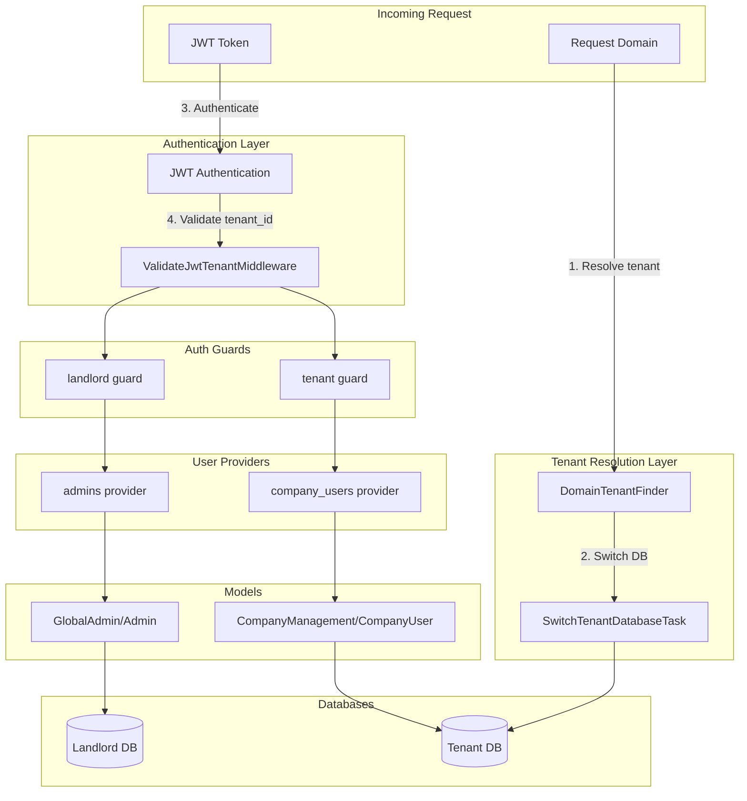

# JWT Auth Guards and Multi-Tenant Configuration

## Tenant Resolution Strategy Decision

### Context

The application needs to resolve which tenant context to use for API requests. Two approaches were evaluated:

| Approach | Description | Pros | Cons |
|----------|-------------|------|------|
| **JWT-only** | Extract `tenant_id` from JWT payload and call `makeCurrent()` | Stateless API, works from any domain | Chicken-and-egg problem: users are in tenant DB, so we need tenant context BEFORE auth |
| **Domain-first (Recommended)** | Use existing `DomainTenantFinder` to resolve tenant, then authenticate user | Already implemented, clear separation of concerns, solves ordering problem | Clients must call correct domain |

### Recommended: Hybrid Approach (Domain + JWT Validation)

**Decision**: Keep `DomainTenantFinder` as primary tenant resolution, add `tenant_id` to JWT claims for security validation.

**Flow**:
```
Request → DomainTenantFinder (resolve tenant) → SwitchTenantDatabaseTask (switch DB) → JWT Auth (authenticate user) → ValidateJwtTenant (verify tenant_id matches)
```

**Benefits**:
- Solves the ordering problem: tenant context is established BEFORE user authentication
- JWT `tenant_id` claim provides additional security layer (prevents token replay across tenants)
- Clear separation: domain = tenant identity, JWT = user identity

## Architecture Overview



---

## Implementation Steps

### 1. Generate JWT Secret

Run `php artisan jwt:secret` to generate and add `JWT_SECRET` to `.env`.

### 2. Update Auth Configuration

Modify [config/auth.php](config/auth.php) to add:

**Guards:**

- `landlord` - JWT driver with `admins` provider
- `tenant` - JWT driver with `company_users` provider

**Providers:**

- `admins` - Points to `Modules\GlobalAdmin\Models\Admin`
- `company_users` - Points to `Modules\CompanyManagement\Models\CompanyUser`

### 3. Create Stub Models

**Admin Model** at `Modules/GlobalAdmin/app/Models/Admin.php`:

- Extends `Authenticatable`
- Uses `HasFactory`, `Notifiable`, `HasUuids` traits
- Implements `JWTSubject` interface
- Uses `UsesLandlordConnection` trait for landlord DB
- Returns empty array for `getJWTCustomClaims()` (no tenant context for landlord users)

**CompanyUser Model** at `Modules/CompanyManagement/app/Models/CompanyUser.php`:

- Extends `Authenticatable`
- Uses `HasFactory`, `Notifiable`, `HasUuids` traits
- Implements `JWTSubject` interface
- Uses tenant connection (default behavior)
- **Important**: Include `tenant_id` in `getJWTCustomClaims()` for security validation:

```php
public function getJWTCustomClaims(): array
{
    return [
        'tenant_id' => \Spatie\Multitenancy\Models\Tenant::current()?->id,
    ];
}
```

### 4. Create ValidateJwtTenantMiddleware

Create `app/Http/Middleware/ValidateJwtTenantMiddleware.php`:

**Purpose**: Security layer that validates the JWT's `tenant_id` claim matches the domain-resolved tenant.

**Implementation**:
```php
<?php

namespace App\Http\Middleware;

use Closure;
use Illuminate\Http\Request;
use Spatie\Multitenancy\Models\Tenant;
use Symfony\Component\HttpFoundation\Response;

class ValidateJwtTenantMiddleware
{
    public function handle(Request $request, Closure $next): Response
    {
        $user = $request->user();
        
        // Skip validation for landlord users (Admin) or unauthenticated requests
        if (!$user || !method_exists($user, 'getJWTCustomClaims')) {
            return $next($request);
        }
        
        $currentTenant = Tenant::current();
        if (!$currentTenant) {
            return $next($request);
        }
        
        // Get tenant_id from JWT payload
        $jwtTenantId = auth()->payload()?->get('tenant_id');
        
        // Validate tenant_id matches current domain-resolved tenant
        if ($jwtTenantId && $jwtTenantId !== $currentTenant->id) {
            abort(403, 'Token not valid for this tenant');
        }
        
        return $next($request);
    }
}
```

**Key Behaviors**:
- Does NOT resolve tenant (that's `DomainTenantFinder`'s job)
- Only VALIDATES that JWT tenant_id matches the already-resolved tenant
- Prevents token replay attacks across tenants
- Gracefully skips validation for landlord users or missing claims

### 5. Register Middleware

Update [bootstrap/app.php](bootstrap/app.php):

```php
->withMiddleware(function (Middleware $middleware): void {
    $middleware
        ->group('tenant', [
            \Spatie\Multitenancy\Http\Middleware\NeedsTenant::class,
            \Spatie\Multitenancy\Http\Middleware\EnsureValidTenantSession::class,
        ])
        ->group('tenant.api', [
            \Spatie\Multitenancy\Http\Middleware\NeedsTenant::class,
            \App\Http\Middleware\ValidateJwtTenantMiddleware::class,
        ]);
})
```

**Note**: `tenant.api` group is for API routes that need tenant context + JWT validation.

### 6. Create Auth Config Tests

Add test at `tests/Unit/AuthConfigTest.php`:

- Assert `landlord` guard exists with JWT driver
- Assert `tenant` guard exists with JWT driver
- Assert providers are correctly configured

### 7. Create JWT Tenant Validation Tests

Add test at `tests/Feature/ValidateJwtTenantMiddlewareTest.php`:

- Test: Valid token with matching tenant_id passes
- Test: Token with mismatched tenant_id returns 403
- Test: Token without tenant_id claim passes (backward compatibility)
- Test: Landlord users bypass validation

### 8. Verify Artisan Commands

Run `php artisan` to ensure no config crashes occur with stub models.

---

## Key Files to Create/Modify

| File | Action |
|------|--------|
| `.env` | Generate JWT_SECRET via artisan |
| [config/auth.php](config/auth.php) | Add guards and providers |
| `Modules/GlobalAdmin/app/Models/Admin.php` | Create stub model |
| `Modules/CompanyManagement/app/Models/CompanyUser.php` | Create stub model with tenant_id in JWT claims |
| `app/Http/Middleware/ValidateJwtTenantMiddleware.php` | Create JWT tenant validation middleware |
| [bootstrap/app.php](bootstrap/app.php) | Register middleware in tenant.api group |
| `tests/Unit/AuthConfigTest.php` | Create config tests |
| `tests/Feature/ValidateJwtTenantMiddlewareTest.php` | Create JWT tenant validation tests |

---

## Existing Components (No Changes Needed)

| File | Purpose |
|------|---------|
| `app/TenantFinder/DomainTenantFinder.php` | Primary tenant resolution via domain |
| `config/multitenancy.php` | Spatie multitenancy configuration |

---

## Request Flow Summary

```
1. Request arrives at tenant domain (e.g., tenant1.sifet.com)
2. DomainTenantFinder resolves tenant from domain
3. SwitchTenantDatabaseTask switches to tenant database
4. JWT authentication verifies user in tenant database
5. ValidateJwtTenantMiddleware confirms JWT tenant_id matches (security)
6. Request proceeds to controller
```
