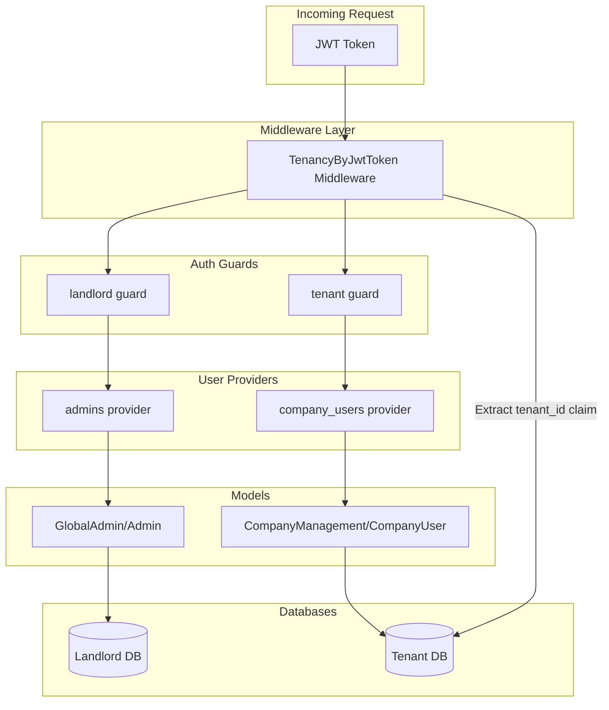

# JWT Auth Guards and Multi-Tenant Configuration

## Architecture Overview

---

## Implementation Steps

### 1. Generate JWT Secret

Run `php artisan jwt:secret` to generate and add `JWT_SECRET` to `.env`.

### 2. Update Auth Configuration

Modify [config/auth.php](config/auth.php) to add:

**Guards:**

- `landlord` - JWT driver with `admins` provider
- `tenant` - JWT driver with `company_users` provider

**Providers:**

- `admins` - Points to `Modules\GlobalAdmin\Models\Admin`
- `company_users` - Points to `Modules\CompanyManagement\Models\CompanyUser`

### 3. Create Stub Models

**Admin Model** at `Modules/GlobalAdmin/app/Models/Admin.php`:

- Extends `Authenticatable`
- Uses `HasFactory`, `Notifiable`, `HasUuids` traits
- Implements `JWTSubject` interface
- Uses `UsesLandlordConnection` trait for landlord DB

**CompanyUser Model** at `Modules/CompanyManagement/app/Models/CompanyUser.php`:

- Extends `Authenticatable`
- Uses `HasFactory`, `Notifiable`, `HasUuids` traits
- Implements `JWTSubject` interface
- Uses tenant connection (default behavior)

### 4. Create TenancyByJwtToken Middleware

Create `app/Http/Middleware/TenancyByJwtToken.php`:

- Decode JWT token from request
- Extract `tenant_id` custom claim
- Find and activate tenant context using `Tenant::find()`
- Fallback gracefully if no tenant_id (allows domain-based resolution)

### 5. Register Middleware

Update [bootstrap/app.php](bootstrap/app.php) to add the new middleware to the `tenant` group.

### 6. Create Auth Config Tests

Add test at `tests/Unit/AuthConfigTest.php`:

- Assert `landlord` guard exists with JWT driver
- Assert `tenant` guard exists with JWT driver
- Assert providers are correctly configured

### 7. Verify Artisan Commands

Run `php artisan` to ensure no config crashes occur with stub models.

---

## Key Files to Create/Modify

| File | Action |
|------|--------|
| `.env` | Generate JWT_SECRET via artisan |
| [config/auth.php](config/auth.php) | Add guards and providers |
| `Modules/GlobalAdmin/app/Models/Admin.php` | Create stub model |
| `Modules/CompanyManagement/app/Models/CompanyUser.php` | Create stub model |
| `app/Http/Middleware/TenancyByJwtToken.php` | Create JWT tenant middleware |
| [bootstrap/app.php](bootstrap/app.php) | Register middleware |
| `tests/Unit/AuthConfigTest.php` | Create config tests |
