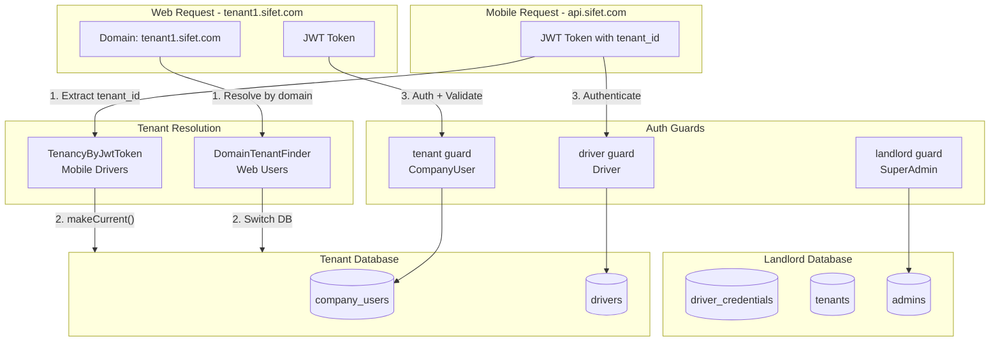
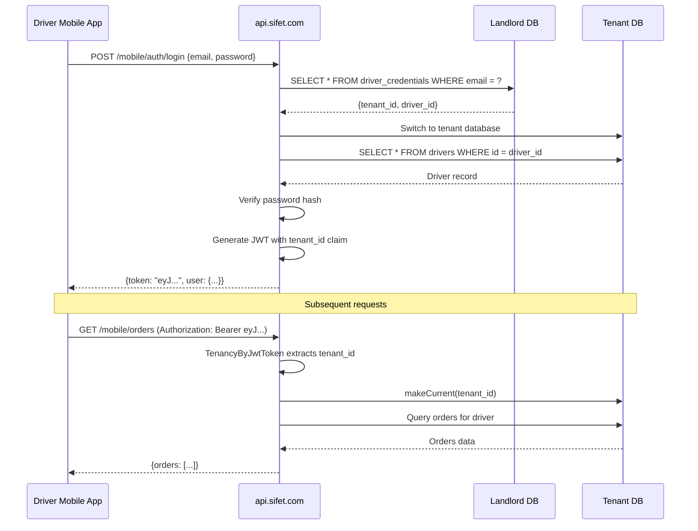

# JWT Auth Guards and Multi-Tenant Configuration

## Tenant Resolution Strategy Decision

### Context

The application has two types of API clients with different characteristics:

| Client Type | Example Users | API Access Pattern | Tenant Resolution |
|-------------|---------------|-------------------|-------------------|
| **Web Apps** | CompanyUser, Store | `tenant1.sifet.com/api/...` | Via domain |
| **Mobile Apps** | Driver | `api.sifet.com/api/...` (central) | Via JWT |

### The Mobile Driver Problem

Mobile apps cannot use domain-based tenant resolution because:
1. Apps call a fixed API URL (e.g., `api.sifet.com`)
2. Drivers are stored in tenant databases
3. Without knowing the tenant, we cannot authenticate the driver

**Chicken-and-egg problem**:
```
To authenticate driver → Need tenant DB
To access tenant DB → Need tenant_id
Driver only provides → email + password (no tenant info)
```

### Solution: Hybrid Approach with Global Credentials Mapping

**Decision**: Use different strategies for web vs mobile:

| User Type | Strategy | Middleware |
|-----------|----------|------------|
| CompanyUser (web) | Domain-first + JWT validation | `ValidateJwtTenantMiddleware` |
| Driver (mobile) | Global credentials lookup + JWT resolution | `TenancyByJwtToken` |

## Architecture Overview: Web Users (CompanyUser)

**Flow**:
```
Request (tenant1.sifet.com) → DomainTenantFinder → Switch DB → JWT Auth → ValidateJwtTenant
```

## Architecture Overview: Mobile Drivers

**Flow**:
```
1. Login: POST api.sifet.com/api/v1/mobile/auth/login {email, password}
2. Lookup: DriverCredential (landlord DB) → find tenant_id
3. Switch: tenant_id → makeCurrent() → switch to tenant DB
4. Auth: Validate password in Driver table (tenant DB)
5. Token: Generate JWT with tenant_id claim
6. Return: JWT to mobile app

Subsequent requests:
Request (api.sifet.com) + JWT → TenancyByJwtToken → Extract tenant_id → makeCurrent() → Process
```

## Architecture Diagram



## Driver Mobile Login Flow



---

## Implementation Steps

### 1. Generate JWT Secret

Run `php artisan jwt:secret` to generate and add `JWT_SECRET` to `.env`.

### 2. Create Driver Credentials Table (Landlord DB)

Create migration for global driver credentials mapping:

```php
// database/migrations/landlord/xxxx_create_driver_credentials_table.php
Schema::connection('landlord')->create('driver_credentials', function (Blueprint $table) {
    $table->uuid('id')->primary();
    $table->string('email')->unique(); // Globally unique email
    $table->foreignUuid('tenant_id')->constrained('tenants')->cascadeOnDelete();
    $table->uuid('driver_id'); // Reference to driver in tenant DB (not FK, different DB)
    $table->timestamps();
    
    $table->index(['email']);
    $table->index(['tenant_id', 'driver_id']);
});
```

### 3. Create DriverCredential Model

Create `Modules/GlobalAdmin/app/Models/DriverCredential.php`:

```php
<?php

namespace Modules\GlobalAdmin\Models;

use Illuminate\Database\Eloquent\Model;
use Illuminate\Database\Eloquent\Concerns\HasUuids;
use Spatie\Multitenancy\Models\Concerns\UsesLandlordConnection;

class DriverCredential extends Model
{
    use HasUuids, UsesLandlordConnection;

    protected $fillable = ['email', 'tenant_id', 'driver_id'];

    public function tenant()
    {
        return $this->belongsTo(Tenant::class);
    }
}
```

### 4. Update Auth Configuration

Modify [config/auth.php](config/auth.php) to add:

**Guards:**

- `landlord` - JWT driver with `admins` provider (SuperAdmin)
- `tenant` - JWT driver with `company_users` provider (CompanyUser)
- `driver` - JWT driver with `drivers` provider (Driver mobile)

**Providers:**

- `admins` - Points to `Modules\GlobalAdmin\Models\Admin`
- `company_users` - Points to `Modules\CompanyManagement\Models\CompanyUser`
- `drivers` - Points to `Modules\FleetManagement\Models\Driver`

```php
'guards' => [
    'landlord' => [
        'driver' => 'jwt',
        'provider' => 'admins',
    ],
    'tenant' => [
        'driver' => 'jwt',
        'provider' => 'company_users',
    ],
    'driver' => [
        'driver' => 'jwt',
        'provider' => 'drivers',
    ],
],

'providers' => [
    'admins' => [
        'driver' => 'eloquent',
        'model' => Modules\GlobalAdmin\Models\Admin::class,
    ],
    'company_users' => [
        'driver' => 'eloquent',
        'model' => Modules\CompanyManagement\Models\CompanyUser::class,
    ],
    'drivers' => [
        'driver' => 'eloquent',
        'model' => Modules\FleetManagement\Models\Driver::class,
    ],
],
```

### 5. Create Stub Models

**Admin Model** at `Modules/GlobalAdmin/app/Models/Admin.php`:

- Extends `Authenticatable`
- Implements `JWTSubject` interface
- Uses `UsesLandlordConnection` trait
- Returns empty `getJWTCustomClaims()` (no tenant context)

**CompanyUser Model** at `Modules/CompanyManagement/app/Models/CompanyUser.php`:

- Extends `Authenticatable`
- Implements `JWTSubject` interface
- Uses tenant connection (default)
- Includes `tenant_id` in `getJWTCustomClaims()`

**Driver Model** at `Modules/FleetManagement/app/Models/Driver.php`:

- Extends `Authenticatable`
- Implements `JWTSubject` interface
- Uses tenant connection (default)
- Includes `tenant_id` in `getJWTCustomClaims()`

```php
// Driver model
public function getJWTCustomClaims(): array
{
    return [
        'tenant_id' => \Spatie\Multitenancy\Models\Tenant::current()?->id,
        'driver_id' => $this->id,
    ];
}
```

### 6. Create ValidateJwtTenantMiddleware (Web Users)

Create `app/Http/Middleware/ValidateJwtTenantMiddleware.php`:

**Purpose**: For web users - validates JWT tenant_id matches domain-resolved tenant.

```php
<?php

namespace App\Http\Middleware;

use Closure;
use Illuminate\Http\Request;
use Spatie\Multitenancy\Models\Tenant;
use Symfony\Component\HttpFoundation\Response;

class ValidateJwtTenantMiddleware
{
    public function handle(Request $request, Closure $next): Response
    {
        $currentTenant = Tenant::current();
        if (!$currentTenant) {
            return $next($request);
        }
        
        $jwtTenantId = auth()->payload()?->get('tenant_id');
        
        if ($jwtTenantId && $jwtTenantId !== $currentTenant->id) {
            abort(403, 'Token not valid for this tenant');
        }
        
        return $next($request);
    }
}
```

### 7. Create TenancyByJwtToken Middleware (Mobile Drivers)

Create `app/Http/Middleware/TenancyByJwtToken.php`:

**Purpose**: For mobile drivers - resolves and activates tenant from JWT claim.

```php
<?php

namespace App\Http\Middleware;

use Closure;
use Illuminate\Http\Request;
use Modules\GlobalAdmin\Models\Tenant;
use Symfony\Component\HttpFoundation\Response;

class TenancyByJwtToken
{
    public function handle(Request $request, Closure $next): Response
    {
        // Only process if no tenant is current (mobile API)
        if (Tenant::current()) {
            return $next($request);
        }
        
        try {
            $jwtTenantId = auth('driver')->payload()?->get('tenant_id');
            
            if ($jwtTenantId) {
                $tenant = Tenant::find($jwtTenantId);
                $tenant?->makeCurrent();
            }
        } catch (\Exception $e) {
            // Token invalid or missing - continue without tenant
        }
        
        return $next($request);
    }
}
```

### 8. Create DriverLoginAction

Create `Modules/FleetManagement/app/Actions/DriverLoginAction.php`:

**Purpose**: Handles the global lookup and authentication for mobile drivers.

```php
<?php

namespace Modules\FleetManagement\Actions;

use Illuminate\Support\Facades\Hash;
use Modules\GlobalAdmin\Models\DriverCredential;
use Modules\GlobalAdmin\Models\Tenant;
use Modules\FleetManagement\Models\Driver;
use PHPOpenSourceSaver\JWTAuth\Facades\JWTAuth;

final class DriverLoginAction
{
    public function handle(string $email, string $password): array
    {
        // Step 1: Lookup in landlord DB
        $credential = DriverCredential::where('email', $email)->first();
        
        if (!$credential) {
            throw new \Exception('Invalid credentials');
        }
        
        // Step 2: Switch to tenant DB
        $tenant = Tenant::find($credential->tenant_id);
        $tenant->makeCurrent();
        
        // Step 3: Find driver in tenant DB
        $driver = Driver::find($credential->driver_id);
        
        if (!$driver || !Hash::check($password, $driver->password)) {
            throw new \Exception('Invalid credentials');
        }
        
        if ($driver->status !== 'active') {
            throw new \Exception('Account is not active');
        }
        
        // Step 4: Generate JWT
        $token = JWTAuth::fromUser($driver);
        
        return [
            'token' => $token,
            'token_type' => 'bearer',
            'expires_in' => config('jwt.ttl') * 60,
            'user' => $driver,
        ];
    }
}
```

### 9. Register Middleware

Update [bootstrap/app.php](bootstrap/app.php):

```php
->withMiddleware(function (Middleware $middleware): void {
    $middleware
        // Web tenant routes (domain-based resolution)
        ->group('tenant', [
            \Spatie\Multitenancy\Http\Middleware\NeedsTenant::class,
            \Spatie\Multitenancy\Http\Middleware\EnsureValidTenantSession::class,
        ])
        // Web API routes (domain + JWT validation)
        ->group('tenant.api', [
            \Spatie\Multitenancy\Http\Middleware\NeedsTenant::class,
            \App\Http\Middleware\ValidateJwtTenantMiddleware::class,
        ])
        // Mobile API routes (JWT-based resolution)
        ->group('mobile', [
            \App\Http\Middleware\TenancyByJwtToken::class,
        ]);
})
```

### 10. Create Mobile Auth Routes

Add routes for driver mobile authentication:

```php
// routes/api.php or Modules/FleetManagement/routes/api.php

// Public route - no auth required
Route::post('/v1/mobile/auth/login', [DriverAuthController::class, 'login']);

// Protected routes - JWT + tenant from token
Route::middleware(['mobile', 'auth:driver'])->prefix('v1/mobile')->group(function () {
    Route::post('/auth/logout', [DriverAuthController::class, 'logout']);
    Route::post('/auth/refresh', [DriverAuthController::class, 'refresh']);
    Route::get('/profile', [DriverAuthController::class, 'profile']);
    // ... other driver routes
});
```

### 11. Create Tests

**AuthConfigTest** (`tests/Unit/AuthConfigTest.php`):
- Assert all guards exist with JWT driver
- Assert all providers are correctly configured

**DriverLoginActionTest** (`tests/Unit/DriverLoginActionTest.php`):
- Test: Valid credentials return JWT with tenant_id
- Test: Invalid email throws exception
- Test: Invalid password throws exception
- Test: Inactive driver throws exception
- Test: JWT contains correct tenant_id claim

**ValidateJwtTenantMiddlewareTest** (`tests/Feature/ValidateJwtTenantMiddlewareTest.php`):
- Test: Matching tenant_id passes
- Test: Mismatched tenant_id returns 403

**TenancyByJwtTokenTest** (`tests/Feature/TenancyByJwtTokenTest.php`):
- Test: Valid JWT activates correct tenant
- Test: Missing JWT continues without tenant
- Test: Invalid JWT continues without tenant

### 12. Verify Artisan Commands

Run `php artisan` to ensure no config crashes occur with stub models.

---

## Key Files to Create/Modify

### Landlord DB & Models

| File | Action |
|------|--------|
| `database/migrations/landlord/xxxx_create_driver_credentials_table.php` | Create driver credentials mapping table |
| `Modules/GlobalAdmin/app/Models/DriverCredential.php` | Create model with UsesLandlordConnection |
| `Modules/GlobalAdmin/app/Models/Admin.php` | Create stub model with JWTSubject |

### Tenant Models

| File | Action |
|------|--------|
| `Modules/CompanyManagement/app/Models/CompanyUser.php` | Create stub model with tenant_id in JWT claims |
| `Modules/FleetManagement/app/Models/Driver.php` | Create stub model with tenant_id in JWT claims |

### Middleware

| File | Action |
|------|--------|
| `app/Http/Middleware/ValidateJwtTenantMiddleware.php` | Validate JWT tenant_id matches domain (web users) |
| `app/Http/Middleware/TenancyByJwtToken.php` | Resolve tenant from JWT (mobile drivers) |

### Actions & Controllers

| File | Action |
|------|--------|
| `Modules/FleetManagement/app/Actions/DriverLoginAction.php` | Global lookup + authenticate driver |
| `Modules/FleetManagement/app/Http/Controllers/DriverAuthController.php` | Mobile auth endpoints |

### Configuration

| File | Action |
|------|--------|
| `.env` | Generate JWT_SECRET via artisan |
| [config/auth.php](config/auth.php) | Add landlord/tenant/driver guards and providers |
| [bootstrap/app.php](bootstrap/app.php) | Register middleware groups (tenant.api, mobile) |

### Tests

| File | Action |
|------|--------|
| `tests/Unit/AuthConfigTest.php` | Verify all guards configured correctly |
| `tests/Unit/DriverLoginActionTest.php` | Test driver login flow |
| `tests/Feature/ValidateJwtTenantMiddlewareTest.php` | Test web JWT validation |
| `tests/Feature/TenancyByJwtTokenTest.php` | Test mobile JWT resolution |

---

## Existing Components (No Changes Needed)

| File | Purpose |
|------|---------|
| `app/TenantFinder/DomainTenantFinder.php` | Primary tenant resolution via domain (web users) |
| `config/multitenancy.php` | Spatie multitenancy configuration |

---

## Request Flow Summary

### Web Users (CompanyUser via tenant1.sifet.com)

```
1. Request arrives at tenant domain (tenant1.sifet.com)
2. DomainTenantFinder resolves tenant from domain
3. SwitchTenantDatabaseTask switches to tenant database
4. JWT authentication verifies CompanyUser in tenant database
5. ValidateJwtTenantMiddleware confirms JWT tenant_id matches domain tenant
6. Request proceeds to controller
```

### Mobile Drivers (via api.sifet.com)

```
Login Flow:
1. POST api.sifet.com/v1/mobile/auth/login {email, password}
2. DriverLoginAction looks up email in driver_credentials (landlord DB)
3. Finds tenant_id, switches to tenant database
4. Validates password against Driver record
5. Generates JWT with tenant_id claim
6. Returns JWT to mobile app

Subsequent Requests:
1. Request arrives at api.sifet.com with JWT
2. TenancyByJwtToken extracts tenant_id from JWT
3. Calls Tenant::find(tenant_id)->makeCurrent()
4. auth:driver guard validates user
5. Request proceeds to controller with correct tenant context
```

---

## Important: Driver Creation Sync

When creating a driver in tenant DB, **also create** a DriverCredential record in landlord DB:

```php
// In CreateDriverAction
DB::transaction(function () use ($data) {
    // 1. Create driver in tenant DB
    $driver = Driver::create([...]);
    
    // 2. Create credential mapping in landlord DB
    DriverCredential::create([
        'email' => $data->email,
        'tenant_id' => Tenant::current()->id,
        'driver_id' => $driver->id,
    ]);
    
    return $driver;
});
```

This ensures mobile login works immediately after driver creation.
