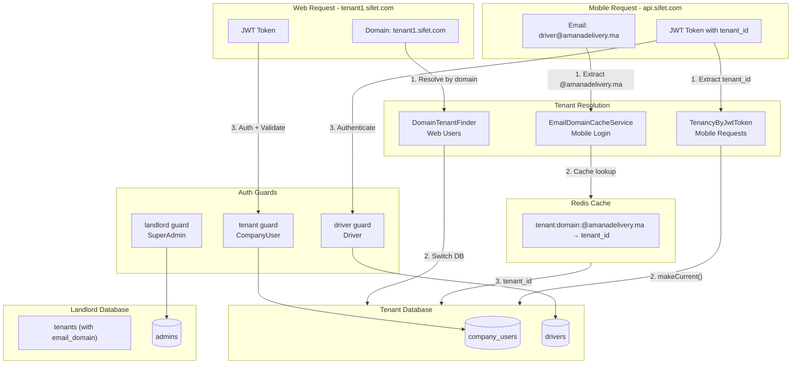
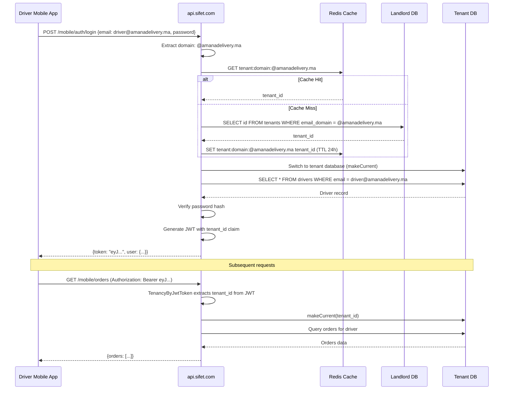

# JWT Auth Guards and Multi-Tenant Configuration

## Tenant Resolution Strategy Decision

### Context

The application has two types of API clients with different characteristics:

| Client Type | Example Users | API Access Pattern | Tenant Resolution |
|-------------|---------------|-------------------|-------------------|
| **Web Apps** | CompanyUser, Store | `tenant1.sifet.com/api/...` | Via domain |
| **Mobile Apps** | Driver | `api.sifet.com/api/...` (central) | Via email domain |

### The Mobile Driver Problem

Mobile apps cannot use domain-based tenant resolution because:
1. Apps call a fixed API URL (e.g., `api.sifet.com`)
2. Drivers are stored in tenant databases
3. Without knowing the tenant, we cannot authenticate the driver

**Chicken-and-egg problem**:
```
To authenticate driver → Need tenant DB
To access tenant DB → Need tenant_id
Driver only provides → email + password (no tenant info)
```

### Solution: Email Domain Mapping (Multi-Tenancy Compliant)

**Decision**: Use email domain to resolve tenant - NO driver data stored in landlord DB.

| User Type | Strategy | Middleware |
|-----------|----------|------------|
| CompanyUser (web) | Domain-first + JWT validation | `ValidateJwtTenantMiddleware` |
| Driver (mobile) | Email domain lookup + JWT resolution | `TenancyByJwtToken` |

**Why NOT store driver credentials in landlord DB?**
- Violates multi-tenancy data isolation principles
- Requires syncing data between tenant and landlord DBs
- Driver data leaks outside tenant boundary

**Email Domain Approach Benefits:**
- NO driver data in landlord DB (strict isolation)
- O(1) Redis cache lookup performance
- Email uniqueness enforced per-tenant only (not globally)
- Simpler architecture - no sync needed between DBs

## Architecture Overview: Web Users (CompanyUser)

**Flow**:
```
Request (tenant1.sifet.com) → DomainTenantFinder → Switch DB → JWT Auth → ValidateJwtTenant
```

## Architecture Overview: Mobile Drivers

**Flow**:
```
1. Login: POST api.sifet.com/api/v1/mobile/auth/login {email, password}
2. Extract: Get domain from email (driver@amanadelivery.ma → @amanadelivery.ma)
3. Lookup: Redis cache (tenant:domain:@amanadelivery.ma → tenant_id)
4. Switch: tenant_id → makeCurrent() → switch to tenant DB
5. Auth: Find driver by email in tenant DB, validate password
6. Token: Generate JWT with tenant_id claim
7. Return: JWT to mobile app

Subsequent requests:
Request (api.sifet.com) + JWT → TenancyByJwtToken → Extract tenant_id → makeCurrent() → Process
```

## Architecture Diagram



## Driver Mobile Login Flow



---

## Implementation Steps

### 1. Generate JWT Secret

Run `php artisan jwt:secret` to generate and add `JWT_SECRET` to `.env`.

### 2. Add Email Domain to Tenants Table

Create migration to add email_domain column to tenants:

```php
// database/migrations/landlord/xxxx_add_email_domain_to_tenants_table.php
Schema::connection('landlord')->table('tenants', function (Blueprint $table) {
    $table->string('email_domain')->unique()->nullable()->after('database_name');
    $table->index('email_domain');
});
```

**Note:** The email_domain stores the company's email domain (e.g., `@amanadelivery.ma`).

### 3. Update Tenant Model

Update `Modules/GlobalAdmin/app/Models/Tenant.php`:

```php
protected $fillable = [
    'id',
    'data',
    'database_name',
    'email_domain', // Add this
];
```

### 4. Create EmailDomainCacheService

Create `app/Services/EmailDomainCacheService.php`:

```php
<?php

namespace App\Services;

use Illuminate\Support\Facades\Cache;
use Modules\GlobalAdmin\Models\Tenant;

final class EmailDomainCacheService
{
    private const CACHE_PREFIX = 'tenant:domain:';
    private const CACHE_TTL = 86400; // 24 hours

    public function getTenantIdByDomain(string $domain): ?string
    {
        $cacheKey = self::CACHE_PREFIX . $domain;
        
        return Cache::store('redis')->remember($cacheKey, self::CACHE_TTL, function () use ($domain) {
            return Tenant::where('email_domain', $domain)->value('id');
        });
    }

    public function invalidate(string $domain): void
    {
        Cache::store('redis')->forget(self::CACHE_PREFIX . $domain);
    }

    public function warmCache(Tenant $tenant): void
    {
        if ($tenant->email_domain) {
            $cacheKey = self::CACHE_PREFIX . $tenant->email_domain;
            Cache::store('redis')->put($cacheKey, $tenant->id, self::CACHE_TTL);
        }
    }
}
```

### 4. Update Auth Configuration

Modify [config/auth.php](config/auth.php) to add:

**Guards:**

- `landlord` - JWT driver with `admins` provider (SuperAdmin)
- `tenant` - JWT driver with `company_users` provider (CompanyUser)
- `driver` - JWT driver with `drivers` provider (Driver mobile)

**Providers:**

- `admins` - Points to `Modules\GlobalAdmin\Models\Admin`
- `company_users` - Points to `Modules\CompanyManagement\Models\CompanyUser`
- `drivers` - Points to `Modules\FleetManagement\Models\Driver`

```php
'guards' => [
    'landlord' => [
        'driver' => 'jwt',
        'provider' => 'admins',
    ],
    'tenant' => [
        'driver' => 'jwt',
        'provider' => 'company_users',
    ],
    'driver' => [
        'driver' => 'jwt',
        'provider' => 'drivers',
    ],
],

'providers' => [
    'admins' => [
        'driver' => 'eloquent',
        'model' => Modules\GlobalAdmin\Models\Admin::class,
    ],
    'company_users' => [
        'driver' => 'eloquent',
        'model' => Modules\CompanyManagement\Models\CompanyUser::class,
    ],
    'drivers' => [
        'driver' => 'eloquent',
        'model' => Modules\FleetManagement\Models\Driver::class,
    ],
],
```

### 5. Create Stub Models

**Admin Model** at `Modules/GlobalAdmin/app/Models/Admin.php`:

- Extends `Authenticatable`
- Implements `JWTSubject` interface
- Uses `UsesLandlordConnection` trait
- Returns empty `getJWTCustomClaims()` (no tenant context)

**CompanyUser Model** at `Modules/CompanyManagement/app/Models/CompanyUser.php`:

- Extends `Authenticatable`
- Implements `JWTSubject` interface
- Uses tenant connection (default)
- Includes `tenant_id` in `getJWTCustomClaims()`

**Driver Model** at `Modules/FleetManagement/app/Models/Driver.php`:

- Extends `Authenticatable`
- Implements `JWTSubject` interface
- Uses tenant connection (default)
- Includes `tenant_id` in `getJWTCustomClaims()`

```php
// Driver model
public function getJWTCustomClaims(): array
{
    return [
        'tenant_id' => \Spatie\Multitenancy\Models\Tenant::current()?->id,
        'driver_id' => $this->id,
    ];
}
```

### 6. Create ValidateJwtTenantMiddleware (Web Users)

Create `app/Http/Middleware/ValidateJwtTenantMiddleware.php`:

**Purpose**: For web users - validates JWT tenant_id matches domain-resolved tenant.

```php
<?php

namespace App\Http\Middleware;

use Closure;
use Illuminate\Http\Request;
use Spatie\Multitenancy\Models\Tenant;
use Symfony\Component\HttpFoundation\Response;

class ValidateJwtTenantMiddleware
{
    public function handle(Request $request, Closure $next): Response
    {
        $currentTenant = Tenant::current();
        if (!$currentTenant) {
            return $next($request);
        }
        
        $jwtTenantId = auth()->payload()?->get('tenant_id');
        
        if ($jwtTenantId && $jwtTenantId !== $currentTenant->id) {
            abort(403, 'Token not valid for this tenant');
        }
        
        return $next($request);
    }
}
```

### 7. Create TenancyByJwtToken Middleware (Mobile Drivers)

Create `app/Http/Middleware/TenancyByJwtToken.php`:

**Purpose**: For mobile drivers - resolves and activates tenant from JWT claim.

```php
<?php

namespace App\Http\Middleware;

use Closure;
use Illuminate\Http\Request;
use Modules\GlobalAdmin\Models\Tenant;
use Symfony\Component\HttpFoundation\Response;

class TenancyByJwtToken
{
    public function handle(Request $request, Closure $next): Response
    {
        // Only process if no tenant is current (mobile API)
        if (Tenant::current()) {
            return $next($request);
        }
        
        try {
            $jwtTenantId = auth('driver')->payload()?->get('tenant_id');
            
            if ($jwtTenantId) {
                $tenant = Tenant::find($jwtTenantId);
                $tenant?->makeCurrent();
            }
        } catch (\Exception $e) {
            // Token invalid or missing - continue without tenant
        }
        
        return $next($request);
    }
}
```

### 8. Create DriverLoginAction

Create `Modules/FleetManagement/app/Actions/DriverLoginAction.php`:

**Purpose**: Extracts email domain, looks up tenant via cache, and authenticates driver.

```php
<?php

namespace Modules\FleetManagement\Actions;

use App\Services\EmailDomainCacheService;
use Illuminate\Support\Facades\Hash;
use Modules\GlobalAdmin\Models\Tenant;
use Modules\FleetManagement\Models\Driver;
use PHPOpenSourceSaver\JWTAuth\Facades\JWTAuth;

final class DriverLoginAction
{
    public function __construct(
        private EmailDomainCacheService $domainCache
    ) {}

    public function handle(string $email, string $password): array
    {
        // Step 1: Extract domain from email
        $domain = $this->extractDomain($email);
        
        // Step 2: Lookup tenant via Redis cache (O(1) performance)
        $tenantId = $this->domainCache->getTenantIdByDomain($domain);
        
        if (!$tenantId) {
            throw new \Exception('Invalid credentials');
        }
        
        // Step 3: Switch to tenant DB
        $tenant = Tenant::find($tenantId);
        $tenant->makeCurrent();
        
        // Step 4: Find driver by email in tenant DB
        $driver = Driver::where('email', $email)->first();
        
        if (!$driver || !Hash::check($password, $driver->password)) {
            throw new \Exception('Invalid credentials');
        }
        
        if ($driver->status !== 'active') {
            throw new \Exception('Account is not active');
        }
        
        // Step 5: Generate JWT
        $token = JWTAuth::fromUser($driver);
        
        return [
            'token' => $token,
            'token_type' => 'bearer',
            'expires_in' => config('jwt.ttl') * 60,
            'user' => $driver,
        ];
    }

    private function extractDomain(string $email): string
    {
        $parts = explode('@', $email);
        
        if (count($parts) !== 2 || empty($parts[1])) {
            throw new \Exception('Invalid email format');
        }
        
        return '@' . strtolower($parts[1]);
    }
}
```

### 9. Register Middleware

Update [bootstrap/app.php](bootstrap/app.php):

```php
->withMiddleware(function (Middleware $middleware): void {
    $middleware
        // Web tenant routes (domain-based resolution)
        ->group('tenant', [
            \Spatie\Multitenancy\Http\Middleware\NeedsTenant::class,
            \Spatie\Multitenancy\Http\Middleware\EnsureValidTenantSession::class,
        ])
        // Web API routes (domain + JWT validation)
        ->group('tenant.api', [
            \Spatie\Multitenancy\Http\Middleware\NeedsTenant::class,
            \App\Http\Middleware\ValidateJwtTenantMiddleware::class,
        ])
        // Mobile API routes (JWT-based resolution)
        ->group('mobile', [
            \App\Http\Middleware\TenancyByJwtToken::class,
        ]);
})
```

### 10. Create Mobile Auth Routes

Add routes for driver mobile authentication:

```php
// routes/api.php or Modules/FleetManagement/routes/api.php

// Public route - no auth required
Route::post('/v1/mobile/auth/login', [DriverAuthController::class, 'login']);

// Protected routes - JWT + tenant from token
Route::middleware(['mobile', 'auth:driver'])->prefix('v1/mobile')->group(function () {
    Route::post('/auth/logout', [DriverAuthController::class, 'logout']);
    Route::post('/auth/refresh', [DriverAuthController::class, 'refresh']);
    Route::get('/profile', [DriverAuthController::class, 'profile']);
    // ... other driver routes
});
```

### 11. Create Tests

**AuthConfigTest** (`tests/Unit/AuthConfigTest.php`):
- Assert all guards exist with JWT driver
- Assert all providers are correctly configured

**EmailDomainCacheServiceTest** (`tests/Unit/EmailDomainCacheServiceTest.php`):
- Test: Cache hit returns tenant_id without DB query
- Test: Cache miss queries DB and caches result
- Test: Invalidate clears cache entry
- Test: warmCache populates cache correctly
- Test: Non-existent domain returns null

**DriverLoginActionTest** (`tests/Unit/DriverLoginActionTest.php`):
- Test: Valid credentials return JWT with tenant_id
- Test: Email domain extraction works correctly
- Test: Unknown email domain throws exception
- Test: Invalid password throws exception
- Test: Inactive driver throws exception
- Test: Invalid email format throws exception
- Test: JWT contains correct tenant_id claim

**ValidateJwtTenantMiddlewareTest** (`tests/Feature/ValidateJwtTenantMiddlewareTest.php`):
- Test: Matching tenant_id passes
- Test: Mismatched tenant_id returns 403

**TenancyByJwtTokenTest** (`tests/Feature/TenancyByJwtTokenTest.php`):
- Test: Valid JWT activates correct tenant
- Test: Missing JWT continues without tenant
- Test: Invalid JWT continues without tenant

### 12. Verify Artisan Commands

Run `php artisan` to ensure no config crashes occur with stub models.

---

## Key Files to Create/Modify

### Landlord DB & Models

| File | Action |
|------|--------|
| `database/migrations/landlord/xxxx_add_email_domain_to_tenants_table.php` | Add email_domain column to tenants table |
| `Modules/GlobalAdmin/app/Models/Tenant.php` | Add email_domain to fillable array |
| `Modules/GlobalAdmin/app/Models/Admin.php` | Create stub model with JWTSubject |

### Services

| File | Action |
|------|--------|
| `app/Services/EmailDomainCacheService.php` | Redis cache for domain→tenant_id mapping |

### Tenant Models

| File | Action |
|------|--------|
| `Modules/CompanyManagement/app/Models/CompanyUser.php` | Create stub model with tenant_id in JWT claims |
| `Modules/FleetManagement/app/Models/Driver.php` | Create stub model with tenant_id in JWT claims |

### Middleware

| File | Action |
|------|--------|
| `app/Http/Middleware/ValidateJwtTenantMiddleware.php` | Validate JWT tenant_id matches domain (web users) |
| `app/Http/Middleware/TenancyByJwtToken.php` | Resolve tenant from JWT (mobile drivers) |

### Actions & Controllers

| File | Action |
|------|--------|
| `Modules/FleetManagement/app/Actions/DriverLoginAction.php` | Email domain extraction + authenticate driver |
| `Modules/FleetManagement/app/Http/Controllers/DriverAuthController.php` | Mobile auth endpoints |

### Configuration

| File | Action |
|------|--------|
| `.env` | Generate JWT_SECRET via artisan |
| [config/auth.php](config/auth.php) | Add landlord/tenant/driver guards and providers |
| [bootstrap/app.php](bootstrap/app.php) | Register middleware groups (tenant.api, mobile) |

### Tests

| File | Action |
|------|--------|
| `tests/Unit/AuthConfigTest.php` | Verify all guards configured correctly |
| `tests/Unit/EmailDomainCacheServiceTest.php` | Test cache hit/miss/invalidation |
| `tests/Unit/DriverLoginActionTest.php` | Test driver login flow with domain extraction |
| `tests/Feature/ValidateJwtTenantMiddlewareTest.php` | Test web JWT validation |
| `tests/Feature/TenancyByJwtTokenTest.php` | Test mobile JWT resolution |

---

## Existing Components (No Changes Needed)

| File | Purpose |
|------|---------|
| `app/TenantFinder/DomainTenantFinder.php` | Primary tenant resolution via domain (web users) |
| `config/multitenancy.php` | Spatie multitenancy configuration |

---

## Request Flow Summary

### Web Users (CompanyUser via tenant1.sifet.com)

```
1. Request arrives at tenant domain (tenant1.sifet.com)
2. DomainTenantFinder resolves tenant from domain
3. SwitchTenantDatabaseTask switches to tenant database
4. JWT authentication verifies CompanyUser in tenant database
5. ValidateJwtTenantMiddleware confirms JWT tenant_id matches domain tenant
6. Request proceeds to controller
```

### Mobile Drivers (via api.sifet.com)

```
Login Flow:
1. POST api.sifet.com/v1/mobile/auth/login {email: driver@amanadelivery.ma, password}
2. DriverLoginAction extracts domain (@amanadelivery.ma) from email
3. EmailDomainCacheService looks up tenant_id via Redis cache
4. If cache miss: query landlord DB and cache result
5. Switch to tenant database (makeCurrent)
6. Find driver by email in tenant DB, validate password
7. Generate JWT with tenant_id claim
8. Return JWT to mobile app

Subsequent Requests:
1. Request arrives at api.sifet.com with JWT
2. TenancyByJwtToken extracts tenant_id from JWT
3. Calls Tenant::find(tenant_id)->makeCurrent()
4. auth:driver guard validates user
5. Request proceeds to controller with correct tenant context
```

---

## Tenant Onboarding: Email Domain Setup

When SuperAdmin creates a new tenant/company:

1. **Provide email domain**: e.g., `@amanadelivery.ma`
2. **System validates**: Domain uniqueness across all tenants
3. **Domain stored**: In `tenants.email_domain` column
4. **Cache populated**: On first driver login (lazy) or via warm-up

### Validation Rules

```php
// In CreateTenantRequest or similar
'email_domain' => [
    'required',
    'string',
    'regex:/^@[a-zA-Z0-9][a-zA-Z0-9-]*\.[a-zA-Z]{2,}$/',
    'unique:landlord.tenants,email_domain',
],
```

### Example Domains

| Company | Email Domain | Driver Email Example |
|---------|--------------|---------------------|
| Amana Delivery | `@amanadelivery.ma` | `hassan@amanadelivery.ma` |
| Flash Express | `@flashexpress.ma` | `youssef@flashexpress.ma` |
| City Courier | `@citycourier.com` | `driver1@citycourier.com` |

### Important Notes

- **NO driver data in landlord DB** - strict multi-tenancy isolation
- **Email uniqueness is per-tenant** - `hassan@amanadelivery.ma` can exist in one tenant, `hassan@flashexpress.ma` in another
- **Driver creation** happens only in tenant DB - no sync needed
- **Cache invalidation** required when tenant's email_domain changes
